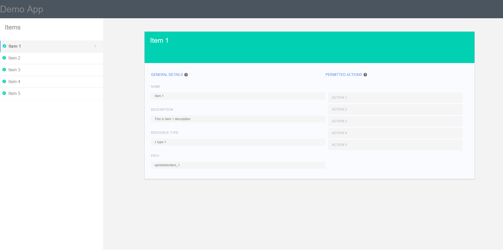
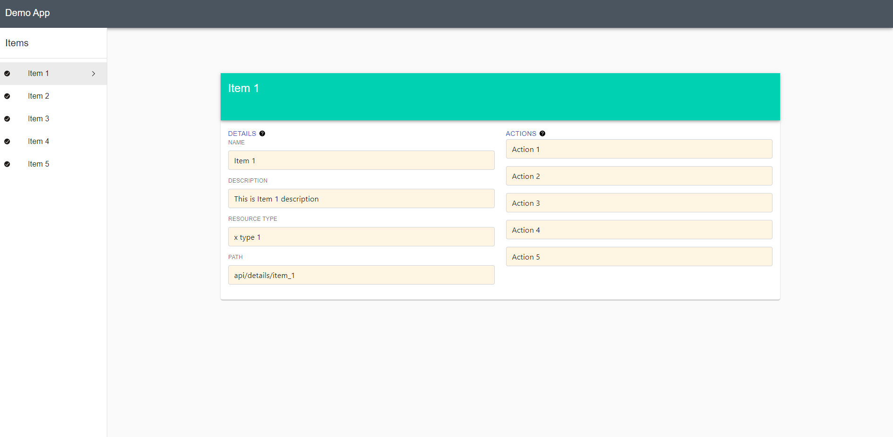

# BrightSource Task

## tasks
1. The code you will build queries the "data.json" stub file (Or you can use the links below)  asynchronously to simulate an API GET request.
2. Once information returns, render the app as shown in the "result.png" image.
3. Once the app is fully rendered the user can switch between resources and the details view (in the middle) should update itself accordingly.

## TODOS:
- [x] fetch resources
- [x] render resources list 
- [x] render resource details when selected
- [x] fetch and render actions for resource
- [x] style page based on refrence image

## improvements
- [ ] render item based off website address path (site.com/:id) `react-router` 
- [ ] Connect Input Fields to form component `formik`
- [ ] code styling and linting
- [ ] github deploy action

### `npm start`

Runs the app in the development mode.\
Open [http://localhost:3000](http://localhost:3000) to view it in the browser.

The page will reload if you make edits.\
You will also see any lint errors in the console.